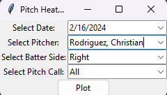

Hello this is similar to my R implementation of a pitch plot, but I decided to expand on it using python instead.

This inlucdes a plot where you can select date, pitcher, batter side, and pitch call selection. A heat map is additionaly created.
